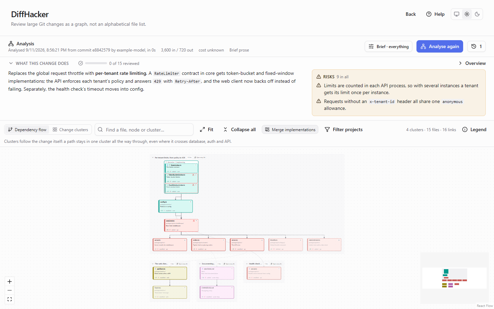
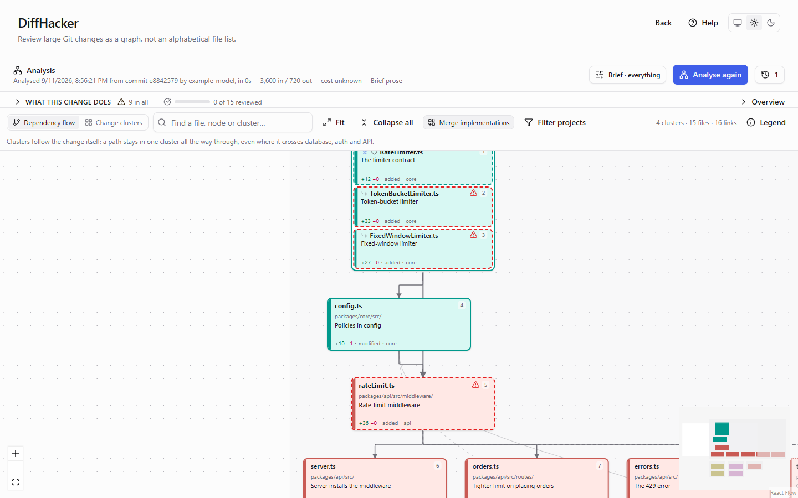
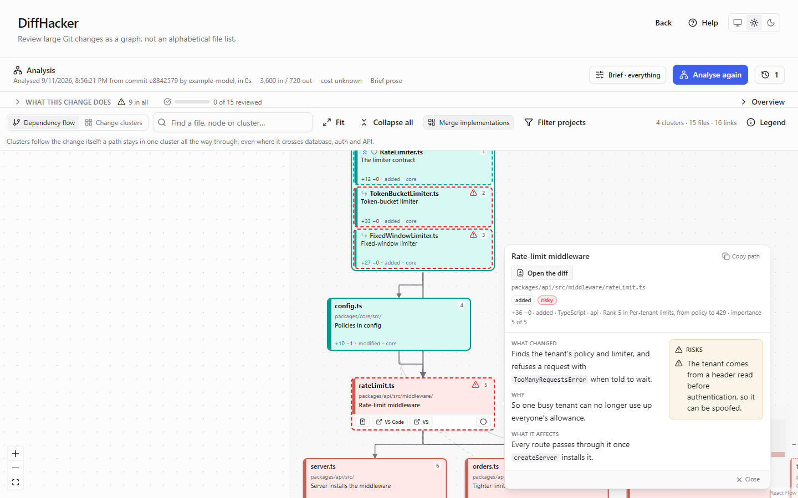
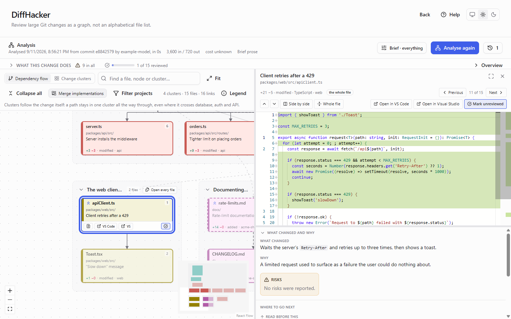
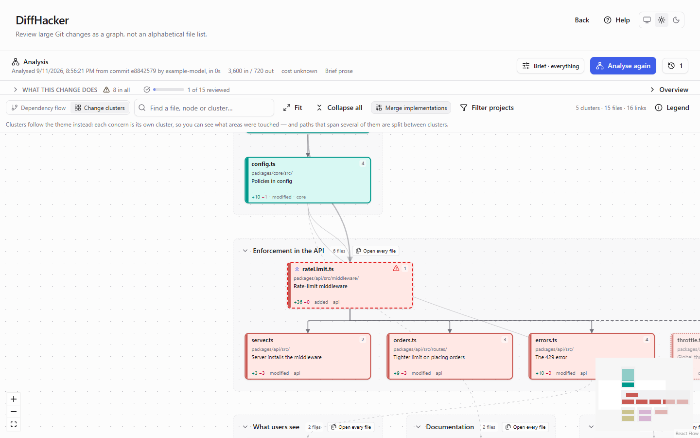
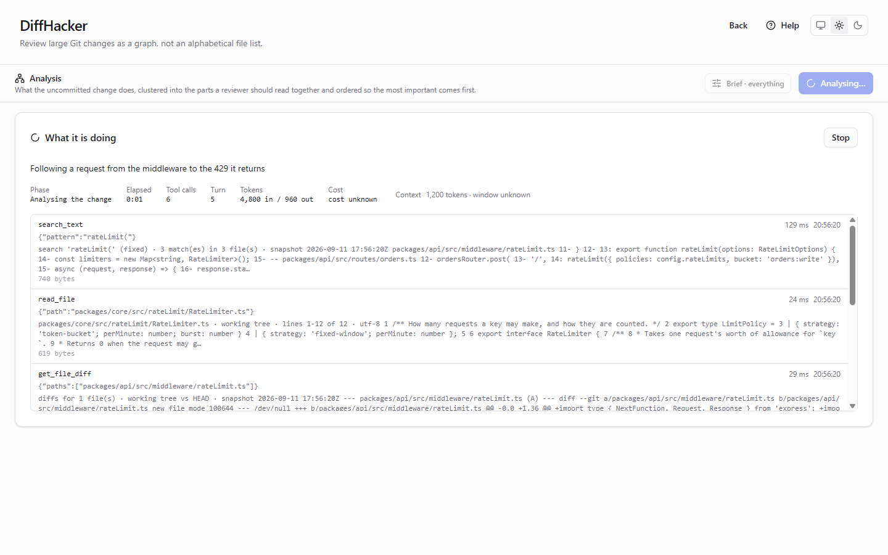
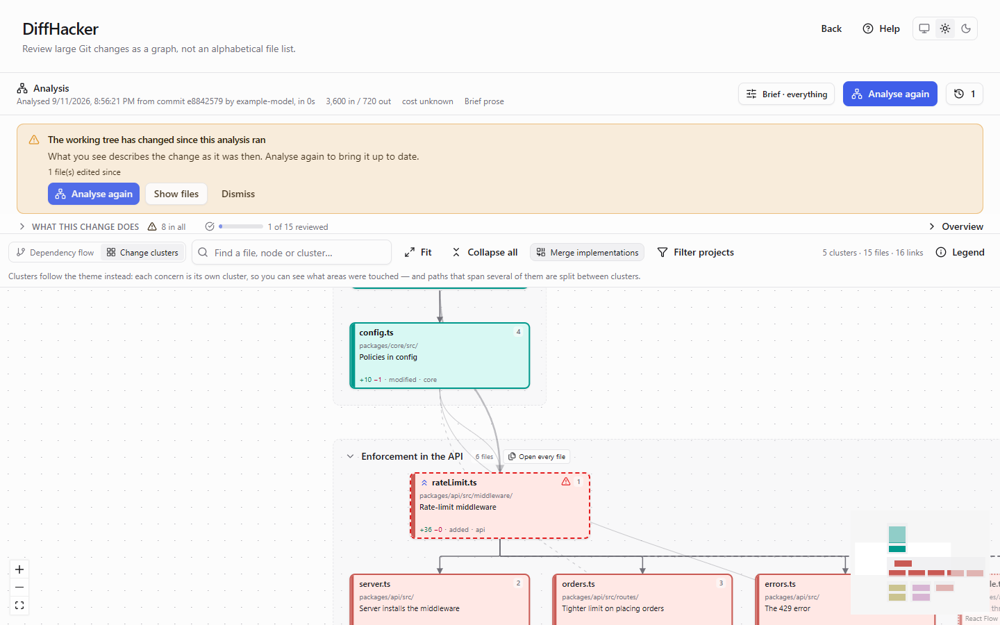

# DiffHacker

**Review large Git changes as a map, not an alphabetical file list.**

DiffHacker is a desktop app that takes the uncommitted change in a local repository and has an LLM
explain it as a diagram: which files belong together, where to start reading, how each part leads
to the next, and what could go wrong.

> ***This project is a test - coding fully delegated to the LLM agent.***



---

## Why

An AI agent just changed 300 files. Your review tool lists them alphabetically, so you open
`AccountController.cs` first because `A` comes first, not because it matters. Then you spend an hour
rebuilding the shape of the change in your head: what drove what, which files are the point and
which are fallout, what is safe to skim and what deserves real attention.

That structure exists, but you can't see it in a file list. DiffHacker rebuilds it for you, before
you read a line of code.

## What it does

### One diagram of the whole change

Related changes are grouped into **clusters**, and unrelated changes land in separate ones. Inside a
cluster, the file to start from is on top and its consequences follow below it. **Solid lines** are
real code dependencies; **dashed lines** are connections of intent, such as a migration and the
endpoint that relies on it, which no import graph would show. Every changed file is on the diagram.
Nothing is summarised away.



### Every box explains itself

Click a file for what changed, why it changed, what it affects, and its risks. Risks always sit in
their own column, apart from the explanation. Click a line for how two files relate, or a cluster's
title for what the cluster is about. Everything was written during the analysis, so opening a card
costs nothing.



### Read the code without losing your place

Double-click a box to open its diff beside the diagram, with the explanation still under the code.
**Previous / Next** follow the recommended reading order, **Where to go next** follows the lines,
and **Mark reviewed** keeps count, so a 300-file review is something you can actually finish. VS
Code, Visual Studio or your own editor opens a file in one click.



### Two ways to group the same change

**Dependency flow** keeps each chain of change whole, even where it crosses the database, the API
and the UI. **Change clusters** groups by theme instead, so you can see which areas were touched.
Both come from the same run, so switching is instant and free.



### Watch it work, and stay in control of the cost

You can watch every analysis while it runs: what the model says it is doing, each tool call it
makes, the tokens and cost so far, and how full its context is. You can stop it at any time. You can
switch off the parts you don't need (risks, explanations, the second grouping) and choose how much
it writes. Runs pause and ask before going past the limits you set. The last 20 runs of each
repository are kept, and reopening one costs nothing.



### It knows when it is out of date

Edit a file after the analysis ran, and a banner lists exactly what has changed since. Undo the edit
and the analysis is current again.



## What you need

- **git** on your PATH.
- **An API key for an LLM provider.** Supported: OpenAI, Anthropic, Google Gemini, Grok (xAI),
  DeepSeek, or any OpenAI-compatible endpoint, including a model served on your own machine. You pay
  the provider directly for what each run uses.
- **A local repository with uncommitted changes.** DiffHacker reviews your working tree against
  `HEAD`: staged, unstaged and new files together.
- **To run it:** download portable release files
- **To build it:** the [.NET SDK 10](https://dotnet.microsoft.com/download) and
  [Node.js 24](https://nodejs.org/).

## Getting started

```bash
git clone https://github.com/C-Coretex/diffhacker.git
cd diffhacker
dotnet build src/DiffHacker.slnx
dotnet run --project src/DiffHacker.Host
```

Then:

1. **Settings → Add a provider.** Paste your API key and press **Test connection**. The test costs
   nothing.
2. **Open a repository** that has uncommitted changes.
3. **Repository profile → Analyse repository.** This is optional but recommended: it is done once,
   and every later analysis is better for it.
4. **Analysis → Analyse this change**, then read the diagram from the top.

The **[user guide](docs/user-guide.md)** walks through all of it step by step with screenshots, and
covers reading the diagram, keyboard shortcuts, an FAQ and troubleshooting. The same guide is inside
the app: press **Help** in the top right corner of any screen.

Publish:
```terminal
dotnet publish src/DiffHacker.Host -c Release -r win-x64 --self-contained true -p:PublishSingleFile=true -p:IncludeNativeLibrariesForSelfExtract=true -p:EnableCompressionInSingleFile=true -o publish/win-x64
```

## Your code and your keys

- **It never changes your repository.** No commits, staging, checkouts or edits, and it only runs
  git commands that read. The single exception is an optional documentation export, which shows you
  every file first and writes only when you confirm.
- **Portions of your source code are sent to the provider you choose.** That's how it works. The
  first request carries only the list of changed files, the repository profile and your
  instructions; the model then reads what it needs through DiffHacker's tools. Those tools see only
  what git sees: nothing in `.git/`, nothing your `.gitignore` excludes. Files that usually hold
  credentials (`.env`, private keys, `.npmrc` and similar) are listed but never opened.
- **API keys are encrypted** under a key held by your operating system (DPAPI on Windows, Keychain on
  macOS, libsecret on Linux). They are never written to the log and never reach the app's interface.
- **Nothing is sent anywhere else.** The only network traffic is to the LLM provider you configure.

## Use its tools from your own agent

The read-only toolbox DiffHacker gives its model (search, read, diff, tree, metadata) is also
available to any MCP client over stdio:

```bash
dotnet build src/DiffHacker.slnx
claude mcp add diffhacker -- <repo>/src/DiffHacker.Mcp/bin/Debug/net10.0/diffhacker-mcp --repository /path/to/your/repo
```

It can't write files, run commands or reach the network, and it caps and pages every result so one
call can't flood a context window.

## Development

| | |
|---|---|
| Build everything (the UI included) | `dotnet build src/DiffHacker.slnx` |
| .NET tests | `dotnet test src/DiffHacker.slnx` |
| UI tests | `npm run test:run` in `src/ui` |
| End-to-end tests (Windows) | `npm test` in `tests/e2e`, after a build |

Built with .NET 10, [PhotinoX](https://github.com/ivanvoyager/PhotinoX), React 19, React Flow, ELK.js,
Monaco and SQLite. If you work on it with an AI coding agent, start with [CLAUDE.md](CLAUDE.md).

## Licence

[MIT](LICENSE). Attribution isn't required, but if DiffHacker is useful in your product or
workflow, a credit and a link back would be appreciated.
