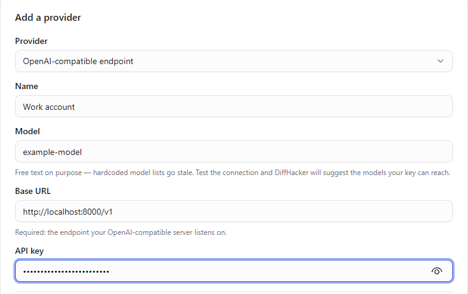
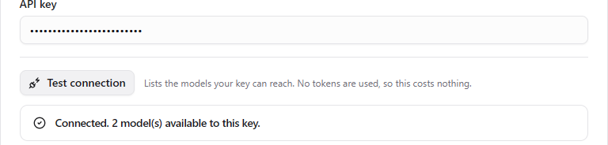
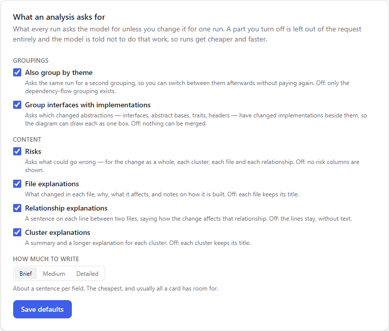
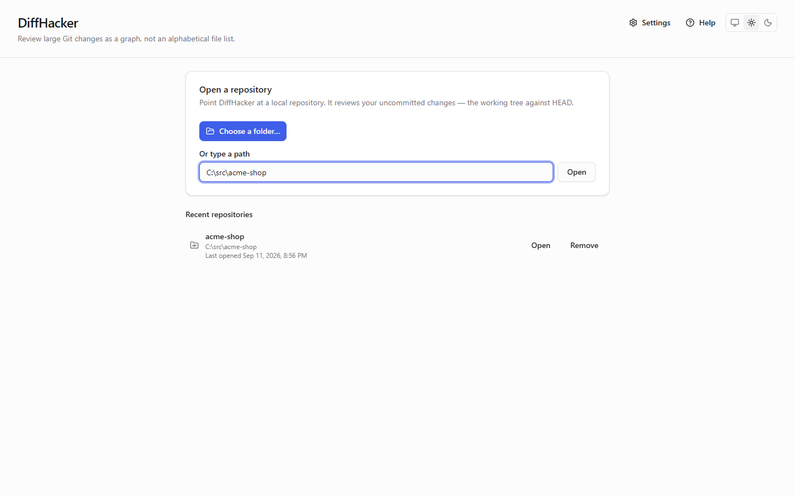
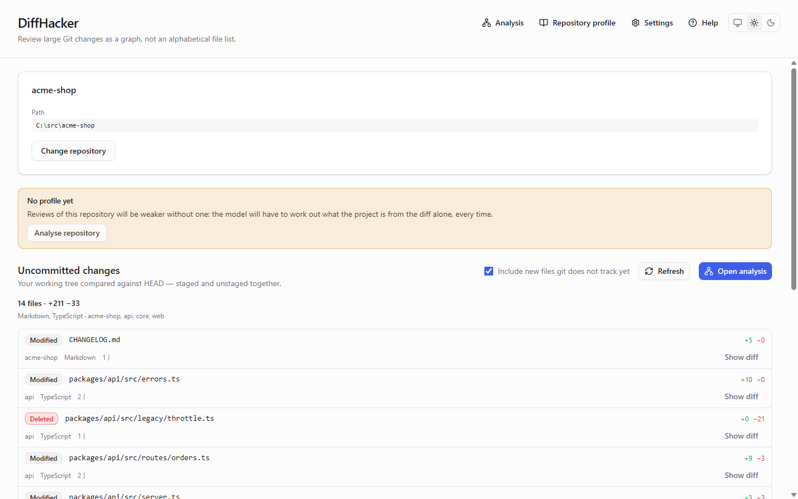
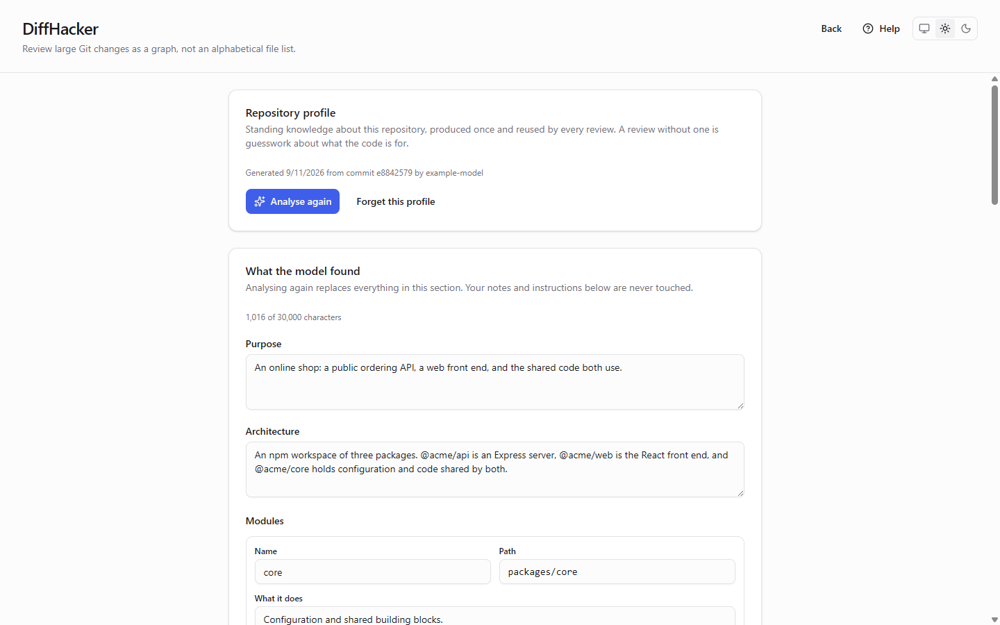
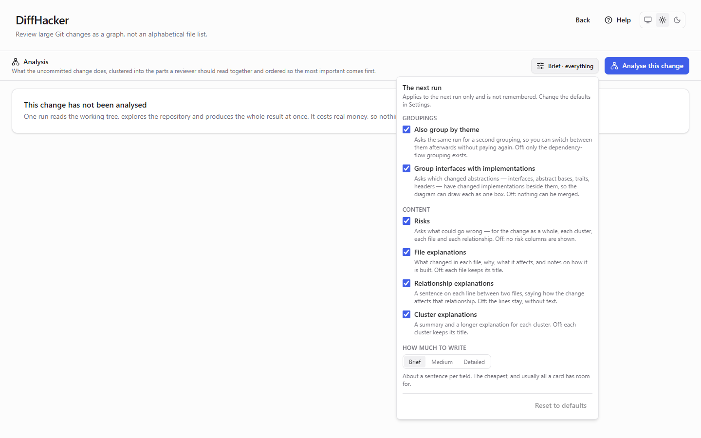
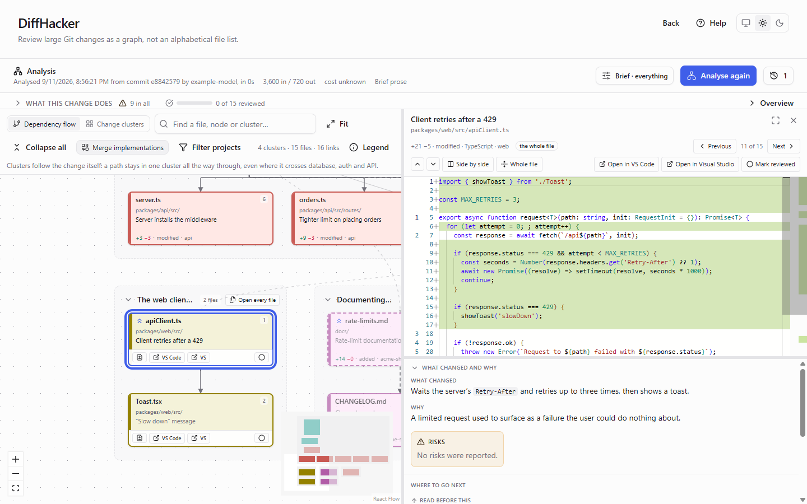

<!--
  Generated from the `help` block of src/ui/src/i18n/en.ts by src/ui/src/help/userGuideMarkdown.ts.
  Do not edit this file: change the catalogue, then run `npm run docs:guide` in src/ui.
-->

# DiffHacker user guide

How to set DiffHacker up, how to read what it shows you, and answers to the questions people ask first.

The same guide is inside the application: press **Help** in the top right corner of any screen.

- [Step-by-step guide](#step-by-step-guide)
- [What DiffHacker does](#what-diffhacker-does)
- [Reading the diagram](#reading-the-diagram)
- [Keyboard shortcuts](#keyboard-shortcuts)
- [FAQ](#faq)
- [Troubleshooting](#troubleshooting)

## Step-by-step guide

From a fresh install to a reviewed change. Steps 1 to 3 happen once; after that, every review starts at step 4.

### 1. Add an LLM provider

DiffHacker uses your own API key, so the first stop is **Settings**, in the top right corner.

1. Press **Add a provider** and choose the provider: OpenAI, Anthropic, Google Gemini, Grok, DeepSeek, or any OpenAI-compatible endpoint — a server on your own machine included, given its base URL.
2. Give it a name you will recognise, type the model identifier, and paste your API key.
3. Press **Save**. With several providers, **Use this one** chooses the one runs use.

The key is kept in your operating system’s secret store. It is never written to the log and never reaches the window you are looking at.

### 2. Test the connection

Press **Test connection** before saving, or any time after. It lists the models your key can reach, uses no tokens and costs nothing.

- A success means the key works. If the model you typed is not among those listed, DiffHacker says so — check the spelling.
- A failure says why: a rejected key, no quota left, or an endpoint that does not answer.

The optional fields under it are worth one look: your own token prices if the bundled price table is out of date, the model’s context window, and **run limits** — how many tool calls and tokens one run may spend before it pauses to ask you.

### 3. Choose what an analysis asks for

Further down **Settings**, **What an analysis asks for** sets the defaults for every run:

- **Also group by theme** — a second grouping you can switch to afterwards without paying again.
- **Group interfaces with implementations** — lets the diagram draw an abstraction and the files implementing it as one box.
- **Risks**, and explanations for files, relationships and clusters.
- **How much to write** — brief (the cheapest), medium or detailed.

A part you turn off is left out of the request entirely, so runs get cheaper and faster. Press **Save defaults** when you are done.

### 4. Open a repository

On the start screen, press **Choose a folder…**, or type a path and press **Open**. A folder anywhere inside a repository works; DiffHacker opens the repository around it.

Repositories you have opened are listed underneath for one click next time.

DiffHacker reviews **uncommitted changes only** — your working tree against `HEAD` — so there has to be something you have not committed yet.

### 5. Check the changed files

The repository screen lists every uncommitted file — staged, unstaged and new — with its status, line counts, language and project.

- **Include new files git does not track yet** is on by default. Turn it off to see only your edits to tracked files.
- **Show diff** on a row gives a quick look at one file.
- **Refresh** after you change something.

Nothing has been sent anywhere yet. **Repository profile** and **Analysis** are in the header.

### 6. Generate the repository profile

The profile is what DiffHacker knows about a repository before it sees a diff: its purpose, architecture, modules, conventions and entry points. It is made once, reused by every analysis, and makes them noticeably better.

1. Open **Repository profile** and press **Analyse repository**. This is an LLM run, so it costs money; you can watch it work and stop it at any time.
2. Correct anything the model got wrong, and press **Save**.
3. Add **Your notes** and **Standing instructions** — “ignore the generated/ folder”, “this is CQRS”. They are sent with every review of the repository, and analysing again never overwrites them.

You can skip this step. Analyses still work without a profile, but the model has to work out what the project is from the diff alone, every time.

### 7. Choose what this run produces

Open **Analysis** from the repository screen. Beside the button that starts a run, **Run options** shows what the next run will ask for — your defaults from Settings.

A change made here applies to **this run only**; the next one starts from your defaults again. It is the place to trim an expensive re-run: fewer parts, or brief prose.

### 8. Run the analysis

Press **Analyse this change**. The model explores the repository through DiffHacker’s tools — reading diffs, searching, opening files — and you can watch it: what it says it is doing, every tool call, the tokens, the cost so far and how full its context is.

- **Stop** ends the run at once. Nothing is saved, and what was already spent is spent.
- A run that reaches one of your limits **pauses and asks** whether to keep going.
- Nothing appears until the whole result exists and has passed DiffHacker’s checks, one of which is that every changed file is in it.

### 9. Read the summary and the risks

A finished analysis opens with **What this change does** on the left and **Risks** in a column of their own on the right — risks are never mixed into the explanations.

- **Overview** unfolds the rest: the recommended reading order, the clusters, the numbers, every risk in one list, and the run’s tool calls.
- The line under the heading says which model produced the analysis, when, and what it cost.
- **History** reopens any earlier run of this repository instantly, without running again.

### 10. Read the diagram

The change is drawn as **clusters** of files that changed for one reason — one box per file, or two for a file that holds two unrelated changes.

- Read **top to bottom**. The box marked **start here** is where a cluster begins; the boxes under it follow from it.
- A box’s **colour** is its project. Its **border and corner badge** say whether it was added, changed or deleted, or carries a risk. A faded box is a mechanical consequence — faded, never hidden.
- **Solid lines** are real code dependencies, **dashed lines** are connections by intent, and faint lines cross between clusters.
- **Legend** explains every mark. **Fit**, **Collapse all**, the search box and **Filter projects** help on a large change.

### 11. Click for the explanation

Click a box for what changed, why, what it affects, and its risks. Click a line for how the two files relate, or a cluster’s title bar for what the cluster is about.

The card stays where it is while you read, scroll or copy from it; click an empty part of the diagram to put it away. Every explanation was written during the run and stored with it, so opening one asks nothing of the model and costs nothing.

### 12. Open the diff

Double-click a box — or use the diff button that appears on it — to open the file beside the diagram, with its explanation still under the code.

- **Previous** and **Next** follow the recommended reading order. **Where to go next** offers the files that lead here and the ones this leads to.
- **Open every file** on a cluster’s title bar turns the whole cluster into a reading list.
- Drag the panel’s edge to widen it, or use **Full screen**. VS Code, Visual Studio or an editor command of your own opens from the panel’s header.

### 13. Mark files reviewed

Press **Mark reviewed** — or the `R` key — as you finish each file. Reviewed boxes are marked on the diagram, and the counters show how much of the change, and of each cluster, you have read.

Marks are saved with the analysis and survive a restart. A new run is a new analysis, so it starts with nothing marked.

### 14. Switch the grouping

**Dependency flow** keeps each chain of change in one cluster, even where it crosses the database, the API and the interface. **Change clusters** groups by theme instead, so you can see which areas were touched — at the cost of splitting those chains.

Both groupings come out of the same run when it was asked for both, so switching is instant and free. **Merge implementations** draws an interface and the files implementing it as one box.

### 15. Keep it current

Edit a file after the analysis ran and a banner says the working tree has changed, and lists what differs: files edited since, files newly changed, files no longer changed. Put the edit back and the banner goes away.

**Analyse again** brings the analysis up to date. Earlier runs stay in **History** — the 20 most recent for each repository — and reopen without spending anything.

## What DiffHacker does

DiffHacker turns a large uncommitted change into a diagram you can review in order.

An AI agent, or a long day, can leave hundreds of changed files behind, and a file list sorted alphabetically hides the shape of the change. DiffHacker gives an LLM of your choice the tools to explore your repository and asks it to explain the change: which files belong together, where to start reading, how each part leads to the next, and what could go wrong.

### What it needs

- `git`, on your PATH.
- An API key for an LLM provider. You pay the provider directly for what each run uses.
- A local repository with uncommitted changes.

### What it never does

- **Change your repository.** It never commits, stages, checks out or edits a file. The one exception is the optional documentation export on the repository profile screen, which shows you every file first and writes only when you confirm.
- **Read what it should not.** Files git ignores are invisible to it, and files that usually hold credentials are listed but never opened.
- **Show half a result.** A run produces a complete, checked analysis, or nothing.

## Reading the diagram

Everything on the diagram is the model’s answer, drawn. The app computes no dependencies of its own.

### Clusters

A cluster is a group of files that changed for one reason, and unrelated changes land in separate clusters. They are laid out in the order to read them. Click a cluster’s title bar for what it is about, fold it with its arrow, or press **Open every file** to read it as a list.

### Boxes

One box per changed file — or two, when a file holds two unrelated changes; the second box’s name ends in `#` and a short label.

- **Fill colour** is the project the file belongs to. Every box also prints the project’s name.
- **Border style and corner badge** say whether the file was added, changed or deleted, and whether it carries a risk.
- **Start here** marks where to begin reading a cluster.
- **Faded** means the model ranked it a mechanical consequence. It is still there, and comes back to full the moment you hover it, search for it or go to it.

### Lines

A line is reading flow: to understand the second file, read the first. It is not a list of calls.

- **Solid** — real code connects the two.
- **Dashed** — connected by intent or by the order to read them, not by code.
- **Faint** — the line crosses between clusters. It is drawn, but kept out of the layout.
- While a cluster is folded, one line can stand for several links.

### Reading order

Inside a cluster, top to bottom is the order to read. **Read in this order**, under **Overview**, gives one path through the whole change, and **Previous** and **Next** in the diff panel walk it.

### Two groupings

**Dependency flow** keeps a chain of change whole; **Change clusters** groups by theme. The second exists only when the run was asked for it — **Also group by theme** — and its button says so when it was not.

### Merged boxes

With **Merge implementations** on, an interface, abstract base or trait is drawn together with the changed files implementing it, as one box with a row per file. Each row is still its own file: it opens its own diff and takes its own reviewed mark.

### Finding your way

- The **search box** finds files, box titles and clusters, and takes you to the one you pick.
- **Filter projects** takes whole projects off the diagram. The analysis is untouched, and a banner says what is hidden.
- **Fit** shows the whole change; **Collapse all** folds every cluster.

## Keyboard shortcuts

On the analysis screen, whenever you are not typing into a field or into the code:

| Key | What it does |
|---|---|
| `J` | Open the next file in the recommended reading order |
| `K` | Open the previous file in the reading order |
| `Enter` | Open the diff of the box the search took you to |
| `R` | Mark the open file reviewed, or unmark it |
| `C` | Fold the open file’s cluster |
| `Escape` | Leave full screen, then close the diff panel |

## FAQ

### Does DiffHacker change my repository?

No. It never commits, stages, checks out or edits files, and it runs only git commands that read. The single exception is the optional documentation export on the repository profile screen: it previews every file first, and writes nothing unless you press **Write to repository**.

### What is sent to the LLM provider?

The first request carries the list of changed files, the repository profile and your standing instructions. Everything else the model asks for through DiffHacker’s tools — a diff, a file, a search — so **portions of your source code do reach the provider**, as with any AI review.

The tools see only what git sees: nothing inside `.git/`, and nothing your `.gitignore` excludes. Files that usually hold credentials — `.env`, private keys, `.npmrc` and the like, plus any patterns you add under **Files never read** on the profile screen — are listed but never opened.

### Where is my API key kept?

Encrypted in DiffHacker’s data folder, under a key held by your operating system: DPAPI on Windows, the Keychain on macOS, libsecret on Linux. Where no keyring is available the key is derived from the machine and your user account instead, and Settings says so. Keys are never written to the log and never reach the interface.

### How much does a run cost?

It depends on the model and the size of the change: you pay your provider for the tokens a run uses. The live view shows the cost so far and every finished analysis shows what it cost. Prices come from a table bundled with DiffHacker, or from the prices you enter for a provider; a model in neither shows as **cost unknown**, never as free.

To spend less, turn parts off in **Run options**, choose brief prose, or set run limits on the provider.

### What happens when a run reaches a limit?

It pauses and asks. **Continue** raises the limit and carries on; **Stop** ends the run, and nothing is saved. Limits are set for each provider in Settings — by default 500 tool calls and 10,000,000 tokens per run.

### Do I need a repository profile?

No, but analyses are better with one. Without it the model has to work out what the project is, how it is organised and what its conventions are from the diff alone, on every run. A profile is made once and reused until you analyse the repository again.

### Can I review a branch, a commit or a pull request?

Not directly. DiffHacker reviews uncommitted changes only: your working tree against `HEAD`, staged, unstaged and new files together.

To review a finished branch without touching your own checkout, make a second worktree at its base and squash the branch into it without committing — `git worktree add --detach ../review main`, then `git merge --squash feature` inside `../review` — and open that folder.

### Why does it say the analysis is out of date?

Every run records a fingerprint of each changed file. When the working tree no longer matches — a file edited, a new change, a change undone, a new commit — the analysis describes a change that no longer exists, and the banner says what differs. Undo the edit and the analysis is current again; **Analyse again** brings it up to date.

### Why does one file appear as two boxes?

The model splits a file only when it holds two unrelated changes, so that each can sit in the cluster it belongs to. Both boxes open the same file, each focused on its own lines.

### Why are two files connected when no code links them?

A dashed line is a connection the model made by intent or by reading order — a migration and the endpoint that relies on it — rather than by an import. DiffHacker deliberately does not draw a dependency graph: a cluster held together by intent alone is exactly the thing a file list cannot show you.

### Why can I not switch to Change clusters?

The run behind this analysis was not asked for the second grouping. Turn on **Also group by theme** in **Run options**, or in Settings for every run, and analyse again.

### Does it work on very large changes?

Yes — ten files or fifteen hundred. A large change takes longer and costs more, and on the diagram **Collapse all**, the search box and **Filter projects** keep it manageable. Every changed file is still in the result: DiffHacker checks that after every run.

### Which model should I use?

A capable one that is good at calling tools and answering in a fixed structure, with a large context window — the better the model, the better the clusters and explanations. If a run fails because the answer could not be read as an analysis, try a more capable model. **Test connection** lists the models your key can reach.

### Can I use a model running on my own machine?

Yes, if it is served through an OpenAI-compatible API: choose **OpenAI-compatible endpoint** and give its base URL. It has to support tool calling, and small models often struggle to produce a complete result for a large change.

### Where does DiffHacker keep its data?

In a folder of its own, never in your repository:

- Windows: `%LOCALAPPDATA%\DiffHacker`
- macOS: `~/Library/Application Support/DiffHacker`
- Linux: `~/.local/share/DiffHacker`, or under `$XDG_DATA_HOME` when it is set

It holds the settings database with your stored analyses, the encrypted keys, and the log.

### Can my own coding agent use DiffHacker’s tools?

Yes. `diffhacker-mcp` serves the same read-only toolbox to any MCP client over stdio. The project’s README shows how to register it.

## Troubleshooting

### Git was not found

DiffHacker reads your repository through the git command line and can do nothing without it. Install git, check that `git --version` works in a terminal, then restart DiffHacker.

### No LLM provider configured

Add one in **Settings**. With several, press **Use this one** on the provider runs should use.

### Test connection fails

The message names the cause. A rejected key: paste it again. No credit or quota: top up with the provider. Nothing answered: check the base URL — an OpenAI-compatible server usually wants one ending in `/v1`.

### Nothing to analyse

The working tree matches `HEAD`, so there is no change to describe. DiffHacker reviews uncommitted changes; make one, or open the repository that has it.

### A run failed

- **Could not be read as an analysis**, or **could not produce a result that covered the whole change**: the model’s answer did not pass DiffHacker’s checks, even after it was asked to repair it. Try again, or use a more capable model.
- **Too large for this model’s context window**: use a model with a larger one, or turn parts off and choose brief prose.
- **Rate-limiting** or **no quota left**: the provider refused the run. Wait, or top up.

### The diagram could not be arranged

Laying the diagram out failed. The analysis itself is stored and safe; reopen it, and if it happens again, the details are in the log.

### Where is the log?

In `logs/log.txt` inside DiffHacker’s data folder — the FAQ lists where that is on each system. API keys are never written to it. It is the first thing worth attaching to a bug report.
